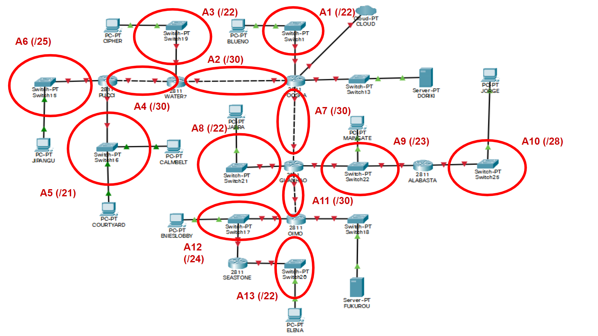
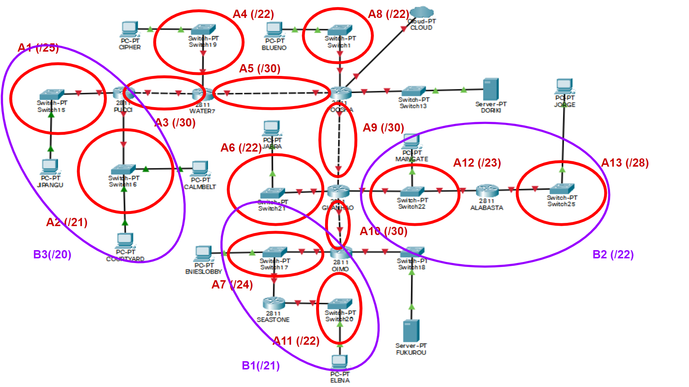
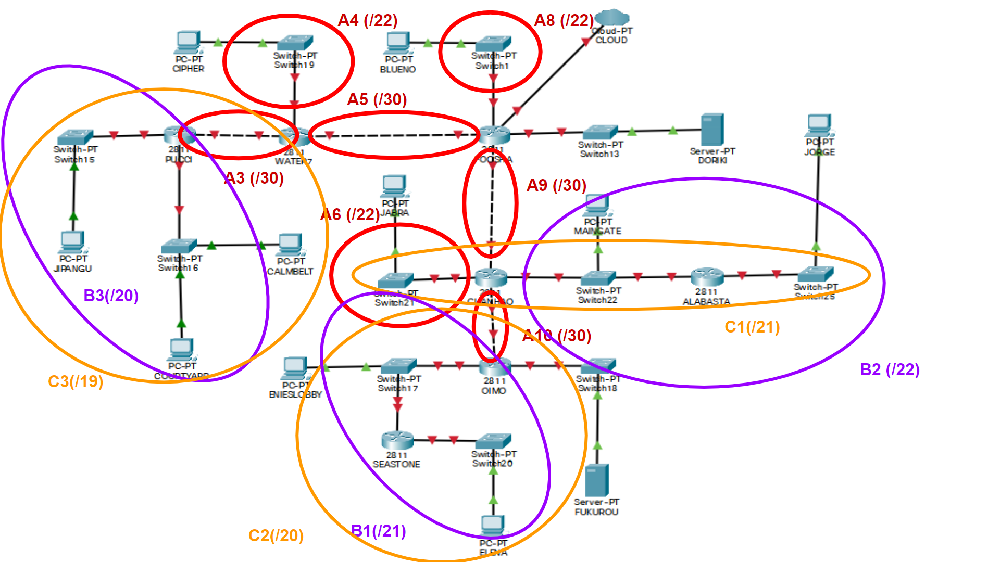
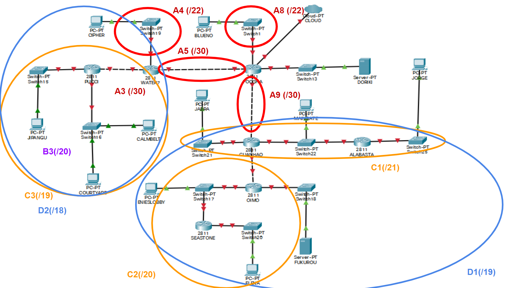
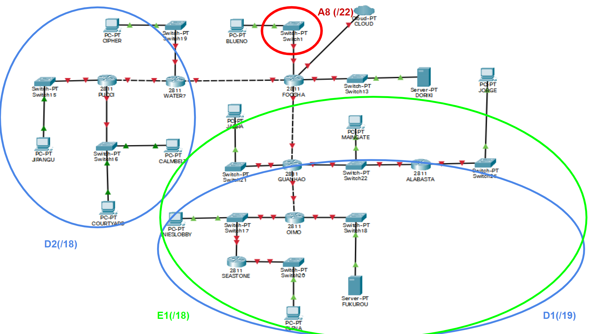
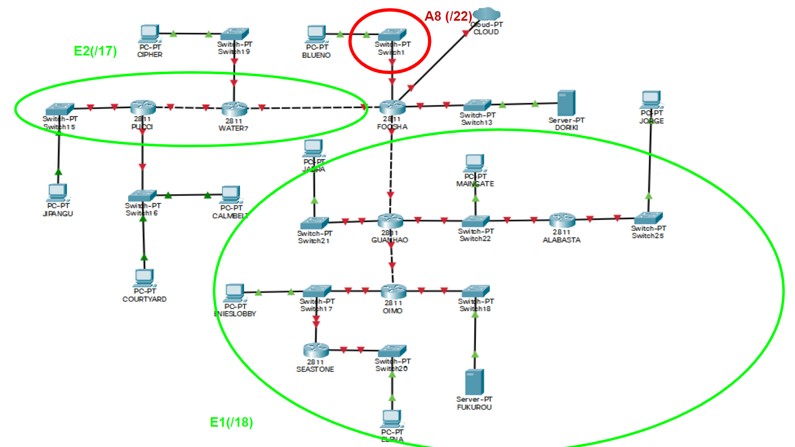
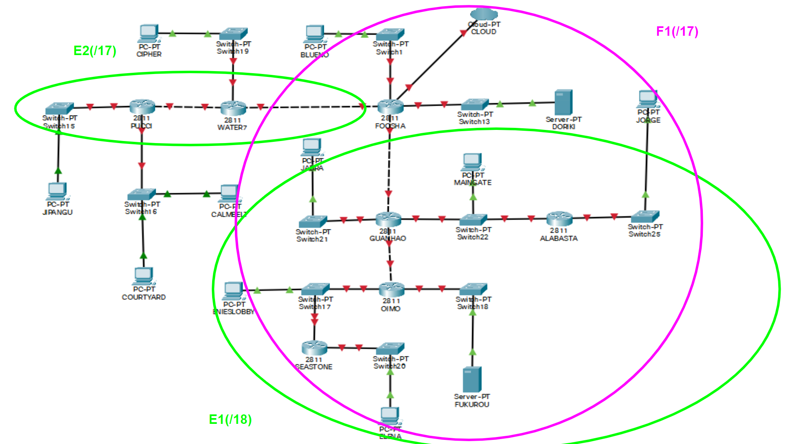
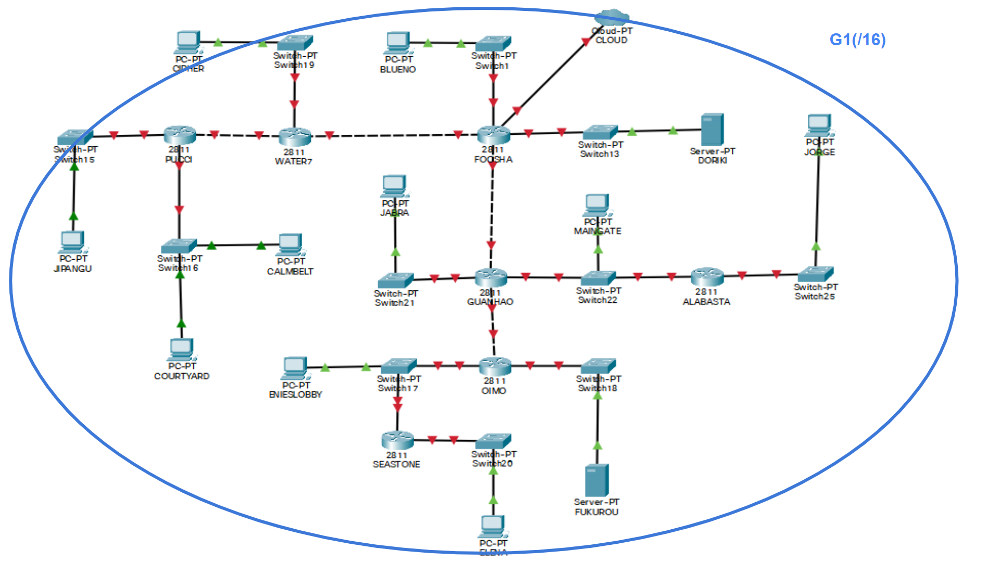
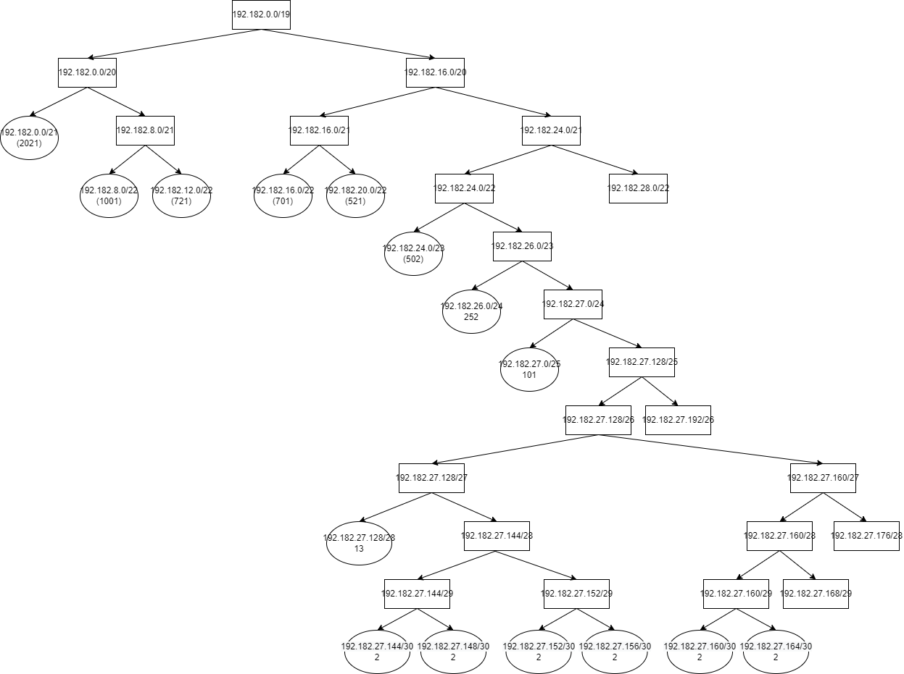

# Jarkom-Modul-4-B11-2021

## **Kelompok B-11**

|      NRP       |         Nama          |
| :------------: | :-------------------: |
| 05111940000079 |    Muhammad Nevin     |
| 05111940000116 | Albert Filip Silalahi |
| 05111940000132 | Jagad Wijaya Purnomo  |

## Topologi


## CPT - VLSM
### Pembagian subnet


### Perhitungan subnet
|Subnet|Jumlah IP|Netmask|
|------|---------|-------|
|A1|1001|/22|
|A2|2|/30|
|A3|701|/22|
|A4|2|/30|
|A5|2021|/21|
|A6|101|/25|
|A7|2|/30|
|A8|521|/22|
|A9|502|/23|
|A10|13|/28|
|A11|2|/30|
|A12|252|/24|
|A13|721|/22|
|**Total**|**5841**|**/19**|

### VLSM Tree


### Pembagian IP
|Subnet|Network ID|Netmask|
|------|----------|-------|
|A1|192.182.8.0|255.255.252.0|
|A2|192.182.0.0|255.255.255.252|
|A3|192.182.12.0|255.255.252.0|
|A4|192.182.0.4|255.255.255.252|
|A5|192.182.24.0|255.255.248.0|
|A6|192.182.0.128|255.255.255.128|
|A7|192.182.0.8|255.255.255.252|
|A8|192.182.16.0|255.255.252.0|
|A9|192.182.2.0|255.255.254.0|
|A10|192.182.0.16|255.255.255.240|
|A11|192.182.0.12|255.255.255.252|
|A12|192.182.1.0|255.255.255.0|
|A13|192.182.20.0|255.255.252.0|

### Routing
|Router|Subnet|Network ID|Netmask|Next Hop|
|------|------|----------|-------|--------|
|**FOOSHA**|A3|192.182.12.0|255.255.252.0|192.182.0.2|
||A5|192.182.24.0|255.255.248.0|192.182.0.2|
||A6|192.182.0.128|255.255.255.128|192.182.0.2|
||A8|192.182.16.0|255.255.252.0|192.182.1.10|
||A9|192.182.2.0|255.255.254.0|192.182.1.10|
||A10|192.182.0.16|255.255.255.240|192.182.1.10|
||A12|192.182.1.0|255.255.255.0|192.182.1.10|
||A13|192.182.20.0|255.255.252.0|192.182.1.10|
||FUKUROU|10.151.79.108|255.255.255.252|192.182.1.10|
|**WATER7**|DEFAULT|0.0.0.0|0.0.0.0|192.182.0.1|
||A5|192.182.24.0|255.255.248.0|192.182.0.6|
||A6|192.182.0.128|255.255.255.128|192.182.0.6|
|**PUCCI**|DEFAULT|0.0.0.0|0.0.0.0|192.182.0.5|
|**GUANHAO**|DEFAULT|0.0.0.0|0.0.0.0|192.182.0.9|
||A10|192.182.0.16|255.255.255.240|192.182.2.2|
||A12|192.182.1.0|255.255.255.0|192.182.0.14|
||A13|192.182.20.0|255.255.252.0|192.182.0.14|
||FUKUROU|10.151.79.108|255.255.255.252|192.182.0.14|
|**ALABASTA**|DEFAULT|0.0.0.0|0.0.0.0|192.182.2.1|
|**OIMO**|DEFAULT|0.0.0.0|0.0.0.0|192.182.0.13|
||A13|192.182.20.0|255.255.252.0|192.182.1.2|
|**SEASTONE**|DEFAULT|0.0.0.0|0.0.0.0|192.182.1.1|

* Konfigurasi Routing

Foosha  
```
192.182.16.0/22 via 192.182.27.150
192.182.27.0/25 via 192.182.27.150
192.182.0.0/21 via 192.182.27.150
192.182.20.0/22 via 192.182.27.154
192.182.24.0/23 via 192.182.27.154
192.182.27.128/28 via 192.182.27.154
192.182.26.0/24 via 192.182.27.154
192.182.12.0/22 via 192.182.27.154
192.182.27.164/30 via 192.182.27.154
192.182.27.156/30 via 192.182.27.154
192.182.27.144/30 via 192.182.27.150
```
Water7
```
0.0.0.0/0 via 192.182.27.149
192.182.27.0/25 via 192.182.27.146
192.182.0.0/21 via 192.182.27.146
```
Pucci
```
0.0.0.0/0 via 192.182.27.145
```
Guanhao
```
0.0.0.0/0 via 192.182.27.153
192.182.27.128/28 via 192.182.24.3
192.182.26.0/24 via 192.182.27.158
192.182.12.0/22 via 192.182.27.158
192.182.27.164/30 via 192.182.27.158
```
Oimo
```
0.0.0.0/0 via 192.182.27.157
192.182.12.0/22 via 192.182.26.3
```
Alabasta
```
0.0.0.0/0 via 192.182.24.1
```
Seastone
```
0.0.0.0/0 via 192.182.26.1
```


## GNS3 - CIDR
### Pembagian subnet
**Langkah 1**


**Langkah 2**


**Langkah 3**


**Langkah 4**


**Langkah 5**


**Langkah 6**


**Langkah 7**


**Hasil subnetting**



### CIDR Tree


* Konfigurasi GNS3  

Foosha
```
route add -net 192.182.128.0 netmask 255.255.128.0 gw  192.182.192.2
route add -net 192.182.0.0 netmask 255.255.128.0 gw 192.182.32.2
```
Guanhao
```
route add -net 192.182.0.0 netmask 255.255.240.0 gw 192.182.8.2
route add -net 192.182.16.0 netmask 255.255.248.0 gw 192.182.16.3
```
Oimo
```
route add -net 192.182.0.0 netmask 255.255.252.0 gw 192.182.4.3
```
Water7
```
route add -net 192.182.128.0 netmask 255.255.192.0 gw 192.182.144.2
```
Pada router FOOSHA, jalankan:
```
iptables -t nat -A POSTROUTING -o eth0 -j MASQUERADE -s 192.182.0.0/16
```

Pada semua node (router dan client) selain FOOSHA, jalankan:
```
echo nameserver 192.168.122.1 > /etc/resolv.conf
```

## Kendala
1. Sedikit bingung dengan pembagian subnet dan pembuatan pohon VLSM dan CIDR.
2. Sedikit bingung dengan routing.
